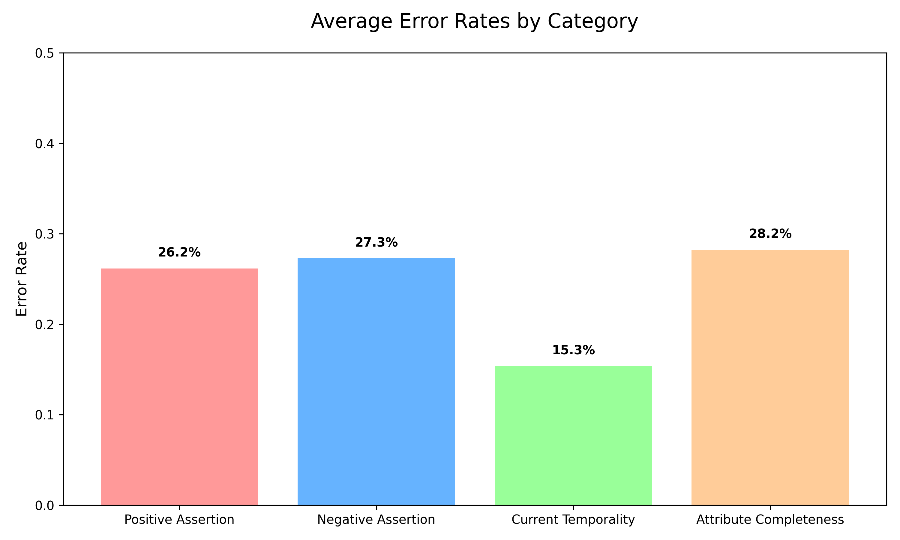

# 🏥 MedNLP Evaluation Framework


A comprehensive, automated evaluation and reliability framework designed to audit Clinical OCR and NLP entity extraction pipelines. This repository contains evaluation scripts, output metrics, and deep-dive analytical reports addressing the common pitfalls of Clinical AI.

This project was built for the **HiLabs Generative AI in Healthcare Workshop**.

## Team-mates:
- Chehek Agrawal
- Atharv Priyadarshi

## 📖 Table of Contents
- [Objective](#-objective)
- [Repository Structure](#-repository-structure)
- [Analytical Report](#-analytical-report)
- [How to Run the Framework](#-how-to-run-the-framework)
- [Proposed Reliability Architecture](#-proposed-reliability-architecture)

## 🎯 Objective

This framework does not aim to retrain clinical NLP models. Instead, it serves as an **Evaluation and Reliability Layer**. It calculates precise error rates across critical dimensions of clinical reasoning to answer:
- Where does the system excel? (e.g., Entity Type extraction)
- Where does the system fail? (e.g., Negation and Temporal reasoning)
- Why do these failures happen, and how do we fix them?

## 📂 Repository Structure

```text
MedNLP-Eval-Framework/
├── output/                     # Contains JSON reports for every processed chart
│   ├── 019M72177...json
│   ├── 363M98433...json
│   └── ...
├── assets/                     # Auto-generated analytical graphs
│   ├── error_rates_bar_chart.png
│   └── file_comparison_chart.png
├── report.md                   # Highly detailed Markdown Analysis Report
├── README.md                   # This file
└── test.py                     # Main evaluation entry-point script
```

## 📊 Analytical Report

We have generated an in-depth analytical report tracking the system's performance on over 30+ medical charts.

👉 **[Read the Full Clinical AI Reliability Report (report.md)](./report.md)**

The report includes:
1. **Quantitative Evaluation Summary**
2. **Interactive Error Heat-Map**
3. **Top Systemic Weaknesses** (Negation Blindness, Temporal Displacement)
4. **Actionable Guardrails**

### Quick Glance: System Performance

<p align="center">
  
</p>

## 🚀 How to Run the Framework

### 1. Run the Evaluation Script (test.py)
The core analysis script evaluates individual medical chart outputs against ground truth / structured schemas.

```bash
python test.py --input test_data/chart_001.pdf --output output/chart_001.json
```

## 🛡️ Proposed Reliability Architecture

As detailed in our [Report](./report.md), we propose implementing absolute guardrails on top of generative extraction pipelines to achieve clinical-grade reliability:

- **Rule-Based Hybrid Layer**: Integrating `pyConTextNLP` / `NegEx` strictly for deterministic assertion management (Handling "patient denies pain").
- **Attribute Validators**: `Pydantic` schema enforcement for completeness (ensuring `DOSE` always accompanies `MEDICATION`).
- **LLM-as-a-Judge**: Specialized, isolated models explicitly prompted for temporal reasoning.
