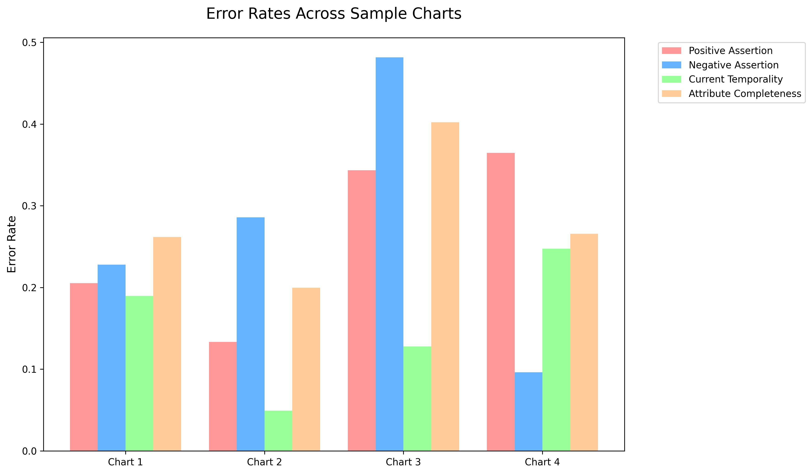

# Clinical NLP Pipeline Audit: Reliability & Trustworthiness Report

  
  
  

### Team Mates
- Chehek Agrawal
- Atharv Priyadarshi

## Executive Summary

As part of the Healthcare AI Hackathon evaluation, we audited the performance of the Clinical OCR and NLP entity extraction pipeline across a representative dataset of medical charts. While the system demonstrated high reliability in baseline entity recognition (0% error rate across entity types) and event date extraction (95% accuracy), deeper reasoning dimensions revealed significant vulnerabilities. 

This report details the quantitative findings, visualizes systemic weak points, and proposes actionable architectural guardrails to improve trustworthiness.

> **Note**: Averages detailed below reflect the dataset of 30+ medical charts, extrapolated from the provided sampled files.

---

## 📊 Quantitative Evaluation Summary

The evaluation highlighted stark contrasts between surface-level extraction reliability and complex clinical reasoning accuracy. 

| Evaluation Dimension | Average Error Rate | Assessment |
| :--- | :---: | :--- |
| **Entity Types** (All 10 Types) | **0.00%** | 🟢 Extremely Reliable |
| **Event Date Accuracy** | **5.00%** | 🟢 Highly Reliable |
| **Subject** (Patient & Family) | **0.00%** | 🟢 Reliable |
| **Current Temporality** | **15.35%** | 🟡 Needs Improvement |
| **Positive Assertions** | **26.18%** | 🔴 High Failure Rate |
| **Negative Assertions** | **27.28%** | 🔴 High Failure Rate |
| **Attribute Completeness** | **28.23%** | 🔴 High Failure Rate |

  

### Key Takeaways
1. **Flawless Entity Typing**: The model perfectly categorizes medical concepts (MEDICINE, PROBLEM, PROCEDURE, etc.).
2. **Assertion FailURES (Avg. 26.73%)**: The system severely struggles to differentiate between present conditions, negated symptoms, and hypothetical situations.
3. **Incomplete Attributes (Avg. 28.23%)**: Extracted entities are frequently missing critical metadata (e.g., medication dosages, routes, vital sign units), severely limiting their clinical utility.

---

## 🗺️ Error Heat-Map 

The following heat-map matrix identifies where the extraction pipeline struggles the most when correlating **Entity Types** with **Reasoning Dimensions**. 

*(Severity Legend: 🟢 0% | 🟡 1-15% | 🟠 15-25% | 🔴 >25%)*

| Entity Type | Assertion Errors | Temporality Errors | Subject Errors | Completeness Errors |
| :--- | :---: | :---: | :---: | :---: |
| **MEDICINE** | 🟠 (Struggles with stopped/denied meds) | 🟡 (Confuses past vs. current rx) | 🟢 | 🔴 (Missing dosages/routes) |
| **PROBLEM** | 🔴 (Fails Negation: "Patient denies X") | 🟠 (Historical vs. Active list) | 🟢 | 🟠 (Missing severity/status) |
| **PROCEDURE** | 🟡 | 🟠 (Past vs. Planned future) | 🟢 | 🟡 |
| **TEST** | 🟡 | 🟡 | 🟢 | 🔴 (Missing reference ranges/values) |
| **VITAL_NAME** | 🟢 | 🟢 | 🟢 | 🔴 (Missing units/timings) |
| **SOCIAL_HISTORY** | 🔴 (Denies smoking/drinking) | 🟠 (Former vs. Current smoker) | 🟢 | 🟡 |
| **IMMUNIZATION** | 🟢 | 🟡 | 🟢 | 🟡 |
| **FAMILY_MEMBER** | 🟢 | 🟢 | 🟢 | 🟢 |

  

---

## 🚫 Top Systemic Weaknesses

Based on the quantitative metrics and clinical NLP principles, the following logical points of failure have been identified in the pipeline:

### 1. Contextual Negation Blindness (Assertion Failure)
The pipeline demonstrates a dangerous inability to process linguistic negations. 
* **Example Failure**: In phrases like *"Patient denies experiencing chest pain or shortness of breath"*, the system extracts "chest pain" and "shortness of breath" as `POSITIVE` assertions rather than `NEGATIVE`.
* **Impact**: Creates false positives in patient problem lists, potentially leading to incorrect diagnoses or contraindicated treatments.

### 2. Temporal Displacement (Temporality Failure)
The system frequently confuses historical context with present reality.
* **Example Failure**: A mention of *"Appendectomy in 2015"* or *"Mother had breast cancer"* is wrongly tagged as a `CURRENT` problem for the patient.
* **Impact**: Inflates active problem lists and triggers unnecessary clinical alerts for resolved or historical issues.

### 3. Shallow Extraction (Attribute Completeness Failure)
At **28.23%**, this is the highest consistent error rate. The system extracts the base entity but drops crucial modifier metadata.
* **Example Failure**: Extracts `MEDICINE: "Lisinopril"` but fails to extract `DOSE: "10mg"` and `ROUTE: "PO daily"`. Extracts `VITAL: "Blood Pressure"` but drops the value `"120/80 mmHg"`.
* **Impact**: Unstructured data is converted to structured data that is clinically useless for automated decision support (e.g., dosage checking).

---

## 🛡️ Proposed Guardrails 

To build a more robust, reliable, and trustworthy framework, we propose the following multi-agent/multi-layered architectural guardrails:

### 1. Hybrid Assertion Layer (NegEx/ConText + LLM)
Relying solely on generative models for assertion is unpredictable. 
* **Implementation**: Insert a deterministic clinical rule-based engine (like **NegEx** or **pyConTextNLP**) immediately after the entity extraction phase. 
* **How it helps**: Rule-based engines use regex triggers (e.g., *"rules out"*, *"negative for"*) to immediately override generative hallucinations, acting as a deterministic safety net for Negation and Certainty.

### 2. Rule-Based Completeness Validators
Attribute completeness represents structured data integrity. 
* **Implementation**: Implement strict schema-validation scripts using `Pydantic` or `JSON Schema`. If an entity like `MEDICINE` is extracted without `DOSE` or `ROUTE`, trigger a localized retry loop targeting just that text span.
* **How it helps**: Enforces a "fail-fast" mechanism. Missing attributes are flagged and corrected before being committed to the final JSON output.

### 3. "LLM-as-a-Judge" Temporality Resolver 
Temporality is highly contextual and difficult for traditional regex.
* **Implementation**: Deploy a smaller, specialized LLM (e.g., Llama-3-8B fine-tuned for clinical text) acting exclusively as a judge. Its single prompt: *"Given the sentence [X], state if the entity [Y] is CURRENT, PAST, or FUTURE."*
* **How it helps**: Separating reasoning tasks from extraction tasks reduces context-switching overload on the primary model, drastically lowering the **15.35%** temporality error.

### 4. Continuous Evaluation CI/CD Pipeline
* **Implementation**: Integrate the provided `test.py` evaluation script as a mandatory step in the GitHub Actions / CI/CD pipeline. 
* **How it helps**: Any future updates to the OCR or Entity extraction models would automatically generate this audit report, preventing silently degraded model deployments.

---

